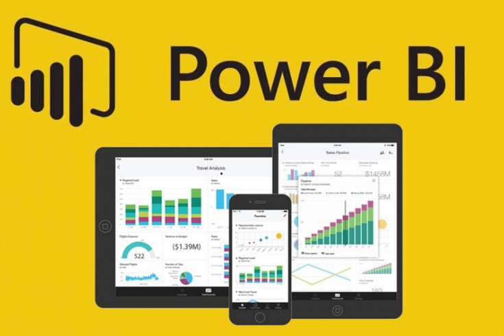

# HR_analytics_Dashboard-
This HR Analytics Dashboard provides key insights into employee attrition, performance, and workforce trends to help optimize HR strategies. It highlights factors influencing retention and suggests actionable improvements for better workforce management. 

## Overview:  
This dashboard is designed to present key HR insights to the senior management of our organization. It provides a detailed analysis of employee attrition, performance, and workforce trends. The goal is to help optimize HR strategies for better workforce management and employee retention.  

## Tool Used:  
&nbsp;  

## Results and Insights:  
- Employee attrition shows a noticeable trend, with peaks in certain months.  
- The highest attrition rates are observed among employees in **Sales and R&D departments**.  
- Employees who work **overtime frequently** have a higher attrition rate.  
- Younger employees (below 30) tend to leave the company more often compared to senior employees.  
- The **average job satisfaction score** is relatively low among employees who resigned.  

## Additional Insights:  
- **Attrition is highest among employees with less than 3 years of experience**, indicating a need for better retention strategies.  
- **Work-life balance plays a major role in employee retention**—employees with poor work-life balance are more likely to leave.  
- **Monthly income and career growth opportunities** directly impact employee satisfaction and retention.  
- The **HR team should focus on improving career development programs** and providing incentives to retain top talent.  

## Data Story:  
The analysis reveals that employees in certain roles, particularly in Sales and R&D, are more likely to leave due to workload and career progression concerns. **Introducing mentorship programs, skill development initiatives, and competitive salary adjustments** can help reduce turnover. Additionally, employees who frequently work overtime have a higher attrition rate, suggesting that **better workload management and flexible work policies** may improve retention.  

## Dashboard:  

